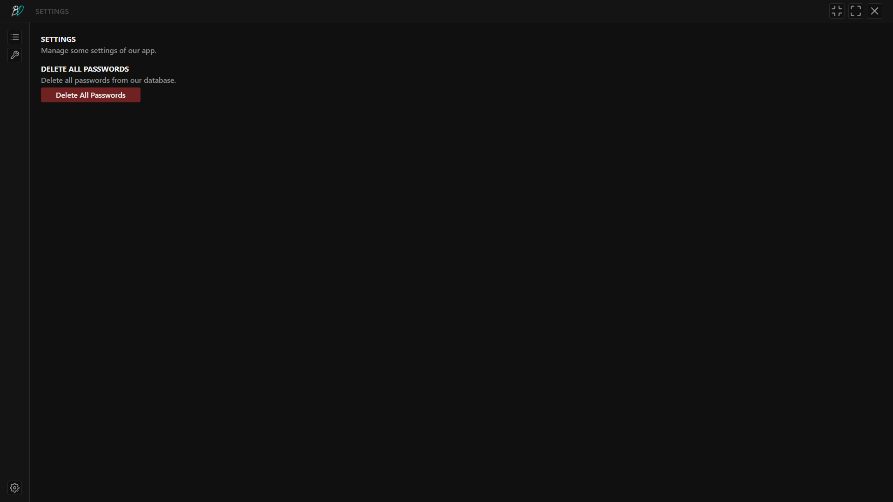

<center>
    <h1>
        password-app
    </h1>
    App to manage your passwords.
</center>

---

This app is a simple project, that's created to make a safe place for all of your passwords. Manage, generate, edit them in one, small and easy-to-use application.

At this moment, you can run these commands in your terminal:
```powershell
git clone https://github.com/m0lc14kk/password-app .
npm install
tsc # If you don't have TypeScript installed on your device, check commands under.
npm run start
```

If you haven't installed TypeScript, you can install it in very few steps:
```
npm install -g typescript
npx init tsc
```

You should be able to build this project by using `tsc` or `npx tsc`.

---

### Showcase





---

### Requirements:
- Atleast Node 20.x.x (or higher version)